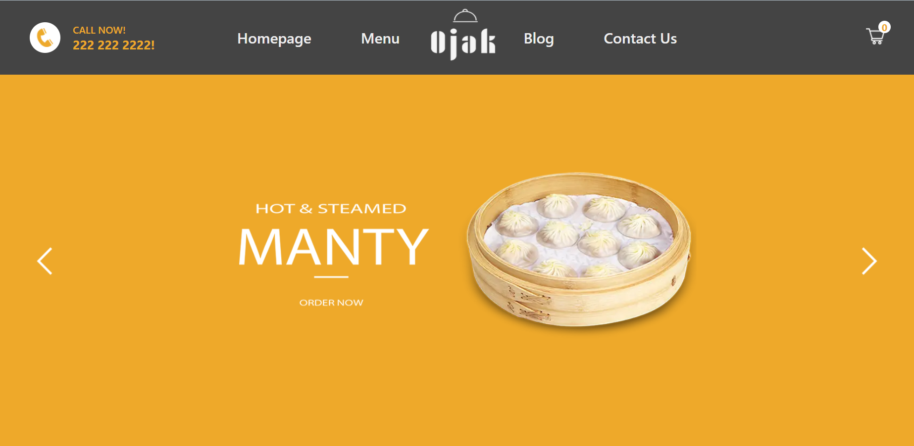

# Ojak - Food Ordering App

[Ojak App](https://ojak.herokuapp.com)

## Features

- Admin Dashboard
- Cart
- Payment
- Product/Food Page

## Stack

- [MongoDB](https://www.mongodb.com) - NoSQL database
- [Next.js](https://nextjs.org) - React framework with additional features
- [Redux](https://redux.js.org) - JavaScript library for managing and centralizing application state

## Project structure

```
$PROJECT_ROOT

|   +-- components                     	// Next Components
|   +-- config                          // MongoDB Configuration
|   +-- models                          // Mongoose Models
|   +-- pages                           
|   |   +-- admin                       // Admin Page
|   |   +-- api                         // API Routes
|   |   +-- order                     	// Order Page
|   |   +-- product                    	// Product Page
|   |   +-- _app.js                    	// App Screen
|   |   +-- cart.jsx                    // Cart Page
|   |   +-- index.js                   	// App Entry Point
|   +-- public                          // Static Files
|   +-- redux                   	// Redux Toolkit
|   +-- styles                    
```

## Packages/Modules utilized

		- @fortawesome/react-fontawesome			: Font Awesome 5 React component using SVG with JS
		- @paypal/react-paypal-js       			: React components for the PayPal JS SDK
		- @reduxjs/toolkit					: toolset for efficient Redux development
		- axios                                 	   	: promise based HTTP client for the browser and Node.js
		- colors						: get colors in your node.js console
		- cookie						: Basic HTTP cookie parser and serializer for HTTP servers.
		- mongoose 						: MongoDB object modeling tool 
		- react							: React is a JavaScript library for creating user interfaces.
		- redux 						: manages and centralizes application state
		- react-redux 						: React UI bindings layer for Redux 


## Steps to Install & Run

1.  Clone the code from this repo
2.  Open terminal on frontend and backend folders and type `npm install #or yarn install`
3.  Run the development server `npm start #or yarn dev`

Open [http://localhost:3000](http://localhost:3000) with your browser to see the result.

## Homepage


